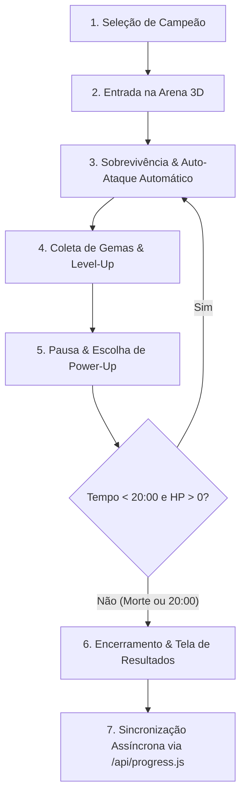

# Arcane Survivors - GDD

## Sumário
- [1. Visão Geral e Hook](#1-visão-geral-e-hook)
- [2. Core Loop](#2-core-loop)
- [3. Mecânicas, UI e Responsividade](#3-mecânicas-ui-e-responsividade)
- [4. Integração de Plataforma (API & Supabase)](#4-integração-de-plataforma-api--supabase)
- [5. Arquitetura Técnica em JavaScript](#5-arquitetura-técnica-em-javascript)

---

## 1. Visão Geral e Hook

> **Nome do Jogo:** Arcane Survivors  
> **Gênero:** *3D Horde Survival / Bullet Heaven Roguelite*  
> **Estética Visual:** *Dark Fantasy / Hades-inspired* (UI dark-mode com acentos dourados e roxos arcanos, modelos low-poly com iluminação dinâmica).  
> **Duração da Partida:** **20 minutos** por tentativa (Soft cap no minuto 20:00 com surgimento do Chefe do Tártaro ou Vitória).  
> **Plataforma Target:** Web Browser (Desktop + Mobile via Touch) integrado à plataforma educacional *"Fundamentos de Jogos Digitais"*.

> ### **O Hook (Por que ele vicia?):**
> O jogo baseia-se no mecanismo de **automação de ataques e sobrecarga cognitiva espacial**. Ao eliminar a necessidade de mira manual e acionamento mecânico de golpes básicos, a atenção do jogador é transferida inteiramente para a **navegação tática**, desvios de hordas massivas em 3D e **tomada de decisão acelerada** na montagem de *builds* hiper-sinérgicas. A transição de um campeão vulnerável para um "triturador de sombras" imparável no minuto 15 cria o ciclo compulsivo de *"só mais uma run"*.

---

## 2. Core Loop



### Detalhamento das Etapas:
1. **Seleção de Campeão:** O jogador escolhe entre 3 classes (*Soulblade*, *Graveguard* ou *Warden of Echoes*), cada uma com atributos base e arma inicial única.
2. **Entrada na Arena 3D:** Spawn em uma arena delimitada do submundo com projeção de câmera *top-down/isometric follow*.
3. **Sobrevivência & Auto-Ataque:** O jogador foca no posicionamento e esquiva; as armas ativas disparam automaticamente com base em intervalos de tempo e padrões geométricos (orbital, frontal, área, raio).
4. **Coleta de Gemas & Level-Up:** Inimigos derrotados dropam gemas de XP na arena. O acúmulo de XP preenche a barra superior e engatilha o nível seguinte.
5. **Overlay de Upgrades:** A simulação congela temporariamente e apresenta 3 a 4 cartas de melhoria sorteadas aleatoriamente da biblioteca de 40 power-ups.
6. **Escalonamento e Clímax:** A dificuldade da horda escala minuto a minuto até o minuto 20:00, onde surge o Chefe do Tártaro.
7. **Persistência no Supabase:** A vitória ou derrota consolida a telemetria da partida e dispara uma requisição REST para salvar XP e conquistas no perfil do aluno.

---

## 3. Mecânicas, UI e Responsividade

### 3.1 Armas Ativas (5 Slots)

| Nome | Tipo | Efeito Visual | Funcionalidade |
| :--- | :--- | :--- | :--- |
| **Lâmina Arcana** | Direcional Frontal | Feixes cortantes em arco roxo brilhante | Executa cortes de curto alcance na direção do movimento, infligindo dano elevado aos inimigos frontais. |
| **Lança de Ossos** | Perfuração Linear | Projétil 3D esquelético com rastro de poeira | Dispara projéteis retilíneos que atravessam múltiplos inimigos em linha reta até o limite da tela. |
| **Orbe de Fogo** | Área Orbital | Esferas flamejantes girando ao redor do avatar | Cria órbitas defensivas ao redor do campeão, causando dano contínuo a qualquer sombra que encoste na aura. |
| **Vento Cortante** | Repulsão Circular | Onda de choque concêntrica translúcida | Emite pulsos periódicos de repulsão de 360°, empurrando hordas próximas e abrindo rotas de fuga. |
| **Relâmpago Sagrado** | Alvo Randômico / AoE | Raios verticais dourados caindo do teto da arena | Atinge posições aleatórias de inimigos na tela com alto dano de impacto imediato e pequeno raio de explosão. |

### 3.2 Status Passivos (5 Slots)

| Nome | Tipo | Efeito Visual | Funcionalidade |
| :--- | :--- | :--- | :--- |
| **Poder (*Might*)** | Dano Global | Aura de brilho carmesim nos pulsos do campeão | Aumenta o dano de todas as armas ativas proporcionalmente ao nível do atributo (+10% por nível). |
| **Agilidade (*Move Speed*)** | Mobilidade | Rastro de sombras/vento nos pés do campeão | Eleva a velocidade de deslocamento base, permitindo esquivas eficientes contra hordas rápidas (+8% por nível). |
| **Vigor (*Max HP*)** | Sobrevivência | Anel de runas verdes ao redor da barra de vida | Expande os pontos de vida máximos e concede pequena regeneração passiva a cada 5 segundos (+20 HP por nível). |
| **Alcance Arcano (*Pickup & Area*)** | Utilidade / Escala | Pulso magnético roxo ao coletar gemas | Incrementa o raio de atração de gemas de XP/itens e aumenta o tamanho/área dos projéteis (+15% raio de atração). |
| **Aceleração (*Cooldown Reduction*)** | Frequência de Ataque | Partículas de ampulheta dourada ao redor da arma | Reduz o tempo de recarga (*cooldown*) de todas as armas equipadas, aumentando o ritmo de disparos (-7.5% cooldown por nível). |

### 3.3 Suporte a Controles (Desktop + Mobile)
* **Desktop:** Teclas `WASD` / Setas direcionais para movimentação fluida de 8 direções.
* **Mobile / Touch:** Injeção dinâmica de um **Virtual Joystick analógico** no canto inferior esquerdo via eventos DOM (`touchstart`, `touchmove`, `touchend`). O módulo de input calcula o vetor normalizado $(x, y)$ repassando o mesmo contrato para a entidade do jogador.

### 3.4 Organização da Interface do Usuário (HUD)
- [ ] **Topo (Header Bar):**
  - Barra de XP fluida com gradiente roxo/dourado e indicador numérico do Nível Arcano atual.
  - Cronômetro central de regressão/progressão da run (`00:00` a `20:00`).
  - Indicador de abates totais de sombras e contador de ouro/gemas da partida.
- [ ] **Canto Inferior Esquerdo (Status do Campeão):**
  - Barra de HP ornamentada com contorno metálico escuro e valor numérico dinâmico.
  - Ícone da classe do campeão selecionado e indicadores de debuffs/buffs ativos.
- [ ] **Canto Inferior Direito (Slots de Módulo/Build):**
  - **5 Slots de Armas Ativas:** Ícones das armas equipadas com contador numérico do nível atual (1 a 5).
  - **5 Slots de Status Passivos:** Ícones das passivas ativas alinhados abaixo dos slots de armas.
- [ ] **Overlay de Upgrade (Level-Up Modal):**
  - Modal suspenso estilo "Cartas de Grimório" que pausa completamente o `GameEngine`.
  - Exibição de 3 a 4 escolhas de cartas com tag de raridade (Comum, Raro, Épico, Lendário).
  - Botão de seleção interativo, ícone descritivo e estatísticas detalhadas do impacto do upgrade.
  - Botão de *Reroll* / *Skip* (consumível por partida).

---

## 4. Integração de Plataforma (API & Supabase)

O minigame opera acionando de forma segura as rotas do backend Node.js para persistir estatísticas no Supabase.

### 4.1 Código de Envio no Cliente (`js/api.js`)

```javascript
/**
 * Envia o resumo de uma run do minigame Arcane Survivors para a API de progresso.
 * @param {string} authToken - Token JWT de autenticação do aluno.
 * @param {Object} runSummary - Resumo da partida contendo XP, duração, abates e build.
 * @returns {Promise<Object>} Resposta da rota /api/progress.js com XP atualizado.
 */
export async function submitMinigameRun(authToken, runSummary) {
  try {
    const response = await fetch('/api/progress.js', {
      method: 'POST',
      headers: {
        'Content-Type': 'application/json',
        'Authorization': `Bearer ${authToken}`
      },
      body: JSON.stringify({
        action: 'addRunXP',
        data: {
          xpGained: runSummary.xpGained,
          durationSeconds: runSummary.durationSeconds,
          enemiesKilled: runSummary.kills,
          characterUsed: runSummary.characterId,
          won: runSummary.isVictory,
          build: {
            weapons: runSummary.weaponSlots,
            status: runSummary.statusSlots
          }
        }
      })
    });

    if (!response.ok) {
      throw new Error(`Erro na API (${response.status}): ${response.statusText}`);
    }

    return await response.json();
  } catch (error) {
    console.error('Falha ao sincronizar progresso com Supabase:', error);
    return { success: false, error: error.message };
  }
}
```

### 4.2 Processamento Backend (`api/progress.js`) & Supabase
1. **`user_profiles`:** Atualiza o XP total acumulado e recalcula o Nível Global do usuário na plataforma.
2. **`user_minigame_runs`:** Insere o registro completo da partida (duração, abates, campeão, build final) para alimentar o gráfico de desempenho do aluno no Hub.
3. **`user_achievements`:** Avalia gatilhos de conquistas automáticas (ex: *Sobreviveu aos 20m -> Conquista "Lorde do Tártaro"*; *Matou +1000 sombras -> Conquista "Ceifador"*).

---

## 5. Arquitetura Técnica em JavaScript

### 5.1 Árvore de Arquivos do Projeto

```
/
├── pages/
│   └── minigame.html                 # Canvas WebGL + HUD HTML/CSS + Canvas Overlays
├── js/
│   ├── main.js                       # Bootstrap, carregamento de assets e menus
│   ├── api.js                        # Ponte HTTP REST com /api/progress.js
│   └── minigame/
│       ├── engine/
│       │   ├── GameEngine.js         # Loop central, State Machine e acúmulo de tempo
│       │   ├── InputHandler.js       # Mapeador WASD / Setas + Virtual Touch Joystick
│       │   └── DifficultyConfig.js   # Tabela e curvas de escalonamento da horda (0-20 min)
│       ├── entities/
│       │   ├── Player.js             # Atributos, posição e slots de armas
│       │   ├── Enemy.js              # Pool de instâncias de inimigos
│       │   ├── Projectile.js         # Pool de projéteis ativos
│       │   └── Pickup.js             # Pool de gemas de XP e coletáveis
│       └── systems/
│           ├── RenderSystem.js       # Three.js: InstancedMesh, Câmera e Iluminação
│           ├── PhysicsSystem.js      # Cannon.js + Spatial Partitioning Grid (Broad-phase)
│           ├── PowerupSystem.js      # Biblioteca de 40 upgrades e sorteio de raridade
│           ├── StatusSystem.js       # Modificadores matemáticos cumulativos
│           └── VfxSystem.js          # Partículas Three-Nebula e shaders VFX-js
├── api/
│   └── progress.js                   # Endpoint Serverless Node.js (integração Supabase)
└── docs/
    └── minigame-gdd.md               # Este Documento de Game Design
```

### 5.2 Game Loop com Passo Fixo e Acumulador (`GameEngine.js`)

```javascript
// js/minigame/engine/GameEngine.js

export class GameEngine {
  constructor() {
    this.timeStep = 1 / 60; // Passos de física fixos em 60 Hz
    this.accumulator = 0;
    this.lastTime = performance.now();
    this.state = 'MENU'; // 'MENU' | 'PLAYING' | 'LEVEL_UP' | 'VICTORY' | 'DEFEAT'
  }

  startLoop() {
    const loop = (now) => {
      const deltaReal = (now - this.lastTime) / 1000;
      this.lastTime = now;

      if (this.state === 'PLAYING') {
        // Clamp no delta para evitar a "espiral da morte" sob picos de lag
        this.accumulator += Math.min(deltaReal, 0.25);

        while (this.accumulator >= this.timeStep) {
          this.updatePhysics(this.timeStep);
          this.accumulator -= this.timeStep;
        }

        // Fator de interpolação linear para renderização suave
        const alpha = this.accumulator / this.timeStep;
        this.renderSystem.render(alpha);
      }

      requestAnimationFrame(loop);
    };

    requestAnimationFrame(loop);
  }

  updatePhysics(dt) {
    this.player.update(dt);
    this.physicsSystem.update(dt);
    this.enemySpawner.update(dt);
    this.checkLevelUpConditions();
  }
}
```

### 5.3 Otimização de Performance Gráfica com `THREE.InstancedMesh`

```javascript
// js/minigame/systems/RenderSystem.js

export class RenderSystem {
  constructor(scene) {
    this.scene = scene;
    this.dummyObject = new THREE.Object3D();
  }

  /**
   * Atualiza as transformações de até 2.500 instâncias de inimigos em 1 única Draw Call.
   * @param {THREE.InstancedMesh} instancedMesh - Buffer de malha instanciada na GPU.
   * @param {Array<Enemy>} enemies - Array de entidades de inimigos.
   */
  updateEnemyHordeInstances(instancedMesh, enemies) {
    for (let i = 0; i < enemies.length; i++) {
      const enemy = enemies[i];

      if (enemy.active) {
        this.dummyObject.position.set(enemy.x, enemy.y, enemy.z);
        this.dummyObject.rotation.y = enemy.rotationY;
        this.dummyObject.scale.setScalar(enemy.scale);
        this.dummyObject.updateMatrix();

        instancedMesh.setMatrixAt(i, this.dummyObject.matrix);
      } else {
        // Esconde instâncias inativas posicionando fora do frustum visual
        this.dummyObject.position.set(0, -9999, 0);
        this.dummyObject.updateMatrix();
        instancedMesh.setMatrixAt(i, this.dummyObject.matrix);
      }
    }

    // Sinaliza à GPU que a matriz de instâncias foi modificada
    instancedMesh.instanceMatrix.needsUpdate = true;
  }
}
```

### 5.4 Detecção de Colisão Otimizada (Grid Spatial Partitioning)
Para mitigar o custo quadrático $O(N^2)$ na verificação de colisões de centenas de projéteis contra milhares de inimigos, o `PhysicsSystem.js` implementa uma **Grade de Particionamento Espacial 2D**. A arena é dividida em células de tamanho fixo (ex: $10 \times 10$ unidades). Durante cada atualização física:
1. Cada entidade atualiza sua referência de célula na grade com base em suas coordenadas $(x, z)$.
2. As checagens de intersecção ocorrem estritamente entre entidades pertencentes à mesma célula ou células adjacentes.
3. A complexidade do algoritmo é reduzida para tempo linear $O(N)$, garantindo 60 FPS cravados em dispositivos móveis e desktops.
