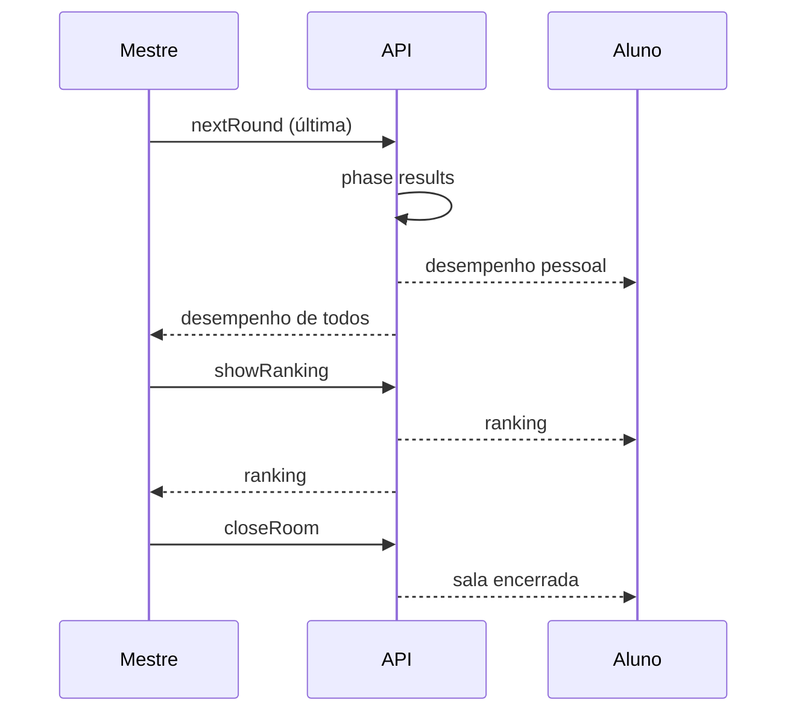

# Plano — Desempenho + Ranking + Fechar sala (ClassInd-dle)

Documento de implementação. Escopo: **fim de sessão** após o deck (hoje ~10 rodadas; o print mostra retorno ao lobby sem tela de resultado).

---

## Diagnóstico

Hoje, em [`api/classind.js`](../api/classind.js) `nextRound`, quando `nextIndex >= deckLength()`:

1. Sala vai para `phase: 'lobby'`
2. Snapshot marca `deckFinished: true`
3. UI em [`VoteBoard.js`](../js/classind-dle/ui/VoteBoard.js) prioriza o ramo `phase === 'lobby' && !sideA` e mostra *“Sala em lobby…”* **antes** de checar `deckFinished` — o fim de deck fica invisível.
4. Não existe tela de desempenho nem ranking; `scoreCorrect` / `scoreAnswered` já existem **por usuário** via `computeUserScore`, mas só no chip da sessão.

Fluxo desejado (após a última revelação + “Próxima comparação”, ou botão explícito “Ver resultados”):



---

## Objetivos de aceite

1. Ao terminar o deck, **ninguém** volta ao lobby “aguarde a próxima comparação”.
2. **Aluno** vê tela de **desempenho próprio** (acertos, total respondido, % opcional, lista curta certo/errado por rodada se couber).
3. **Mestre** vê **acertos de todos** os participantes elegíveis (alunos), na mesma fase.
4. Em seguida (CTA do Mestre: “Ver ranking”), todos veem um **ranking** ordenado por acertos.
5. Depois do ranking, o Mestre **encerra a sala** (`closeRoom`); alunos veem estado encerrado e podem voltar à Aula 05 / trocar de sala.
6. Smokes cobrem phase `results` / `ranking` + payload sem secrets indevidos.

---

## Design da solução

### 1) Nova fase de sala: `results` → `ranking` → `closed`

| Phase | Quem controla | UI |
| --- | --- | --- |
| `results` | Automática ao fim do deck | Desempenho (aluno = próprio; mestre = tabela de todos) |
| `ranking` | Mestre: botão “Ver ranking” | Lista ordenada (posição, nome, acertos) |
| `closed` | Mestre: “Encerrar sala” (já existe) | Mensagem de encerrado |

Persistir `phase` em `classind_rooms.phase` (já é texto livre; migration só se houver CHECK constraint — ver SQL atual).

**Não** reutilizar `lobby` + `deckFinished` como tela final. Manter `deckFinished: true` no snapshot como flag auxiliar, mas a UI final depende de `phase`.

### 2) API

Arquivo: [`api/classind.js`](../api/classind.js)

**`nextRound` (fim de deck)**  
Em vez de `phase: 'lobby'`:

- `phase: 'results'`
- `current_round_index` = `deckLength()` (ou manter último índice + flag)
- Snapshot público: `phase`, `deckFinished: true`, **sem** sides/secrets
- `buildClientState`:
  - Aluno: `myPerformance: { scoreCorrect, scoreAnswered, rounds?: [...] }`
  - Mestre / host: `leaderboardPreview` ou `performances: [{ userId, username, scoreCorrect, scoreAnswered }]` (só alunos; excluir admin/host)

**Nova action `showRanking`** (admin/host only)

- Exige `phase === 'results'`
- Seta `phase: 'ranking'`
- Snapshot + state com `ranking: [{ rank, username, scoreCorrect, scoreAnswered }]` ordenado por `scoreCorrect` desc, depois `scoreAnswered` desc, empate estável por username

**`closeRoom`**  
Continua como hoje; disponível em `results` e `ranking` (e lobby). Preferência UX: no ranking, CTA primário “Encerrar sala”.

**Helpers**

- Extrair `buildSessionScores(roomId)` reusando `computeUserScore` + roster de alunos.
- Opcional: detalhe por rodada (`roundsBreakdown`) só no desempenho pessoal do aluno (choice vs correctSide após reveal — já é pós-reveal, ok).

**Anti-spoiler**

- Em `results`/`ranking`, snapshot público **não** reabre ratings de rodadas futuras; breakdown pessoal só de rounds já `revealed`.

### 3) Client UI

Arquivos novos sugeridos:

- [`js/classind-dle/ui/ResultsPanel.js`](../js/classind-dle/ui/ResultsPanel.js) — desempenho
- [`js/classind-dle/ui/RankingPanel.js`](../js/classind-dle/ui/RankingPanel.js) — ranking

Orquestração em [`js/classind-dle/index.js`](../js/classind-dle/index.js) `renderRoom`:

```
if (phase === 'results') → ResultsPanel
else if (phase === 'ranking') → RankingPanel
else if (phase === 'closed') → empty encerrado
else → VoteBoard / Reveal / Host como hoje
```

**ResultsPanel**

- Aluno: título “Seu desempenho”; chip `Acertos X/Y`; lista compacta das rodadas jogadas (acertou/errou/não votou).
- Mestre: título “Desempenho da turma”; tabela Nome | Acertos | Respondidas; botão **“Ver ranking”**.
- Sem botões de voto.

**RankingPanel**

- Lista `#1 …` com medalha tipográfica (ouro/prata/bronze só visual).
- Mestre: botão **“Encerrar sala”** (confirm já existente).
- Aluno: “Aguarde o Mestre encerrar” + ranking visível.

**HostControls**

- Em `results` / `ranking`: esconder Abrir/Revelar/Próxima; manter Encerrar (e Ver ranking só no Results via ResultsPanel).
- Corrigir ordem em VoteBoard: se `deckFinished` ou phase results, **nunca** mostrar lobby genérico.

### 4) CSS

[`css/classind-dle.css`](../css/classind-dle.css): blocos `.classind-results`, `.classind-ranking`, linhas de placar alinhadas ao visual Hades (sem cards desnecessários no hero; aqui é tela de interação/resultado — lista ok).

### 5) Por que “8 ou 9 rodadas”?

Deck tem **10** pares (`deckLength() === 10`). Possíveis causas do retorno cedo ao lobby:

- Bug de UI: `deckFinished` mas ramo lobby ganha (parece “acabou” sem resultado).
- Ou o Mestre não avançou todas as revelações / sala recriada.

No aceite desta entrega: fluxo `results` só dispara quando `nextIndex >= deckLength()`. Se quiser sessão mais curta depois, outro plano (setting `maxRounds` na createRoom).

### 6) Smokes / playbook

- `classind-api-smoke`: `nextRound` no fim → `phase === 'results'`; `showRanking` → `ranking`; admin vê `performances`; aluno não vê scores dos outros em `results` (só o próprio).
- `classind-dle-pages-smoke`: módulos Results/Ranking; index trata phases.
- [`docs/playbook-liberar-aula5.md`](./playbook-liberar-aula5.md) §4: checklist “fim de deck → desempenho → ranking → encerrar”.

---

## Ordem de implementação

1. Fix UI: não mostrar lobby genérico quando `deckFinished` / phase final.  
2. API: `phase: 'results'` no fim do deck + payload de desempenho.  
3. UI ResultsPanel (aluno + mestre).  
4. Action `showRanking` + RankingPanel.  
5. Encerrar sala a partir do ranking (CTA claro).  
6. Smokes + playbook.

---

## Fora de escopo (neste plano)

- Persistência de ranking no Grimório / conquistas extras.
- Empates com desempate por tempo de voto.
- Reduzir deck para 8 rodadas (só se pedido depois).
- Tela de desempenho **no meio** da sessão (já existe chip Acertos X/Y).

---

## Aceite (checklist)

- [x] Fim do deck → `phase: results` (não lobby “aguarde comparação”).
- [x] Aluno: desempenho pessoal claro.
- [x] Mestre: acertos de todos os alunos.
- [x] Botão “Ver ranking” → ranking ordenado para todos.
- [x] Após ranking, Encerrar sala fecha a sessão.
- [x] Smokes verdes; playbook atualizado.
