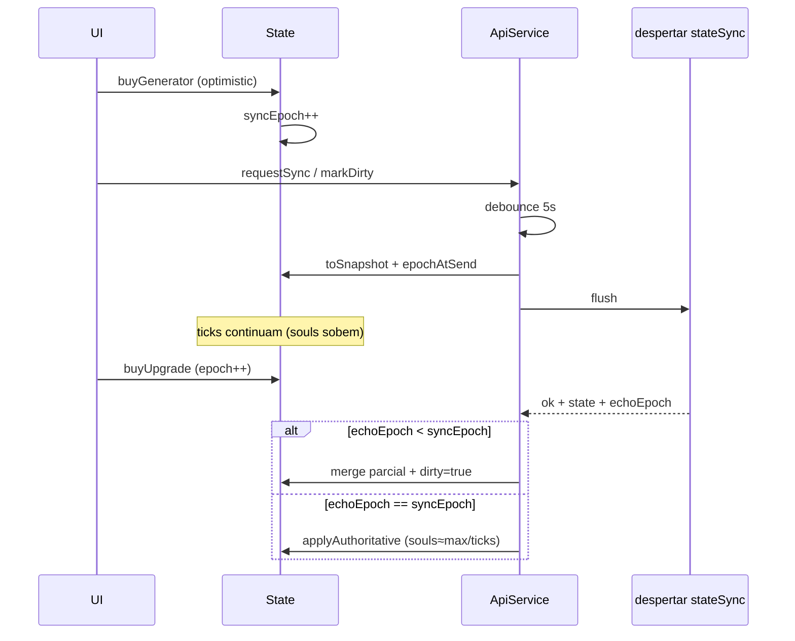

# Plano — Sync anti-rubberband · Debug · Lethe/Tutoriais · Loja Styx · Cosméticos · Juramentos Selados

**Status:** análise congelada (2026-09-22) — execução via guia fatiado  
**Data:** 2026-09-22  
**Pai:** [`plano-hades-despertar.md`](./plano-hades-despertar.md) · [`plano-despertar-ui-cookieclicker.md`](./plano-despertar-ui-cookieclicker.md) · [`plano-despertar-aureolas-letreiro-shiny-hud-juizo.md`](./plano-despertar-aureolas-letreiro-shiny-hud-juizo.md)  
**Guia de implementação (fases A–F):** [`despertar-sync/00-master-plan.md`](./despertar-sync/00-master-plan.md)  
**Gatilho:** feedback do Mestre — rubberbanding em compras rápidas; painel debug incompleto; Lethe sem reveal; loja Styx poluída; Juramentos Selados espaçados vs Cookie; cosméticos de upgrade; shiny raro/invisível em teste  
**Escopo:** client (`js/hades-despertar/**`) + API sync/debug (`api/_lib/despertar-*.js`) + CSS/HTML; **sem** reabrir anti-cheat de almas além do necessário para reconciliar compras.

> **Como executar:** este documento é a **análise** (problema → solução → aceite).  
> Tasks, checklists e DoD por fase vivem em [`docs/despertar-sync/`](./despertar-sync/00-master-plan.md) — mesmo padrão de [`docs/otimizacoes/00-master-plan.md`](./otimizacoes/00-master-plan.md).

---

## 0. Mapa de dependências (ordem sugerida)

```
Fase A Sync anti-rubberband      ← bloqueia confiança em tudo que compra rápido
 ├─ Fase B Debug (setters + free shop + force shiny)
 ├─ Fase D Loja Styx (prereq + sort)  ← independente de sync após A estável
 ├─ Fase C Lethe reveal + tutoriais   ← paralelo a D
 ├─ Fase E Cosméticos upgrade→sprite  ← após D
 └─ Fase F Juramentos Selados Cookie  ← paralelo; só UI Stats
```

Estimativa grossa: **A 1–1,5 d** · **B 0,5 d** · **D 0,5–1 d** · **C 0,5 d** · **E 1–1,5 d** · **F 0,5 d**.  
Detalhe rastreável: [`despertar-sync/00-master-plan.md`](./despertar-sync/00-master-plan.md).

---

## 1. Sincronização e estado (anti-rubberband)

### 1.1 Análise do problema

Compras locais são **otimistas** (`GameState.buyGenerator` / `buyUpgrade` em `index.js`), depois `api.requestSync()`. O flush em `ApiService.js`:

- debounced por `SYNC_MIN_INTERVAL_MS` (**5 s**);
- em sucesso **e** em `400`/`409` chama `applyAuthoritativeState` com o snapshot do servidor;
- se um flush já está `_inFlight`, o próximo `flush()` reusa a mesma Promise e, ao terminar, zera `_dirty` — compras feitas **durante** o RTT podem sumir do próximo envio;
- o snapshot enviado é o de **início** do flush; o loop continua tickando almas; a resposta puxa o mundo **para trás** alguns segundos (sensação de “tempo voltou”).

Isso se agrava com spam de compra (×10/×100) + rejeição `maxGain` (teto calculado com SPS **pré**-compra no DB).

### 1.2 Solução técnica proposta

**Padrão:** *optimistic UI + action log + merge no apply* (não “só debounce mais”).

#### A) Fila de versão de sync (client)

```
state.syncEpoch++  a cada mutação suja (buy / prestige local fallback)
flush envia { ...snapshot, clientEpoch }
onResponse: se response.echoEpoch < state.syncEpoch → NÃO aplicar souls/gens cegamente;
            aplicar só campos “server-authoritative” (verdicts, juizo_*, lastSyncAt)
            e remarcar _dirty + scheduleFlush
```

Campos a **sempre** aceitar do servidor (autoridade): `verdicts`, `juizo*`, `verdictPurchases`, `talents` se vieram de RPC dedicada, `lastSyncAt`.  
Campos a **fundir** se `clientEpoch` avançou: `souls`, `generators`, `upgrades`, `shinyCounts`, `runSouls` — preferir **max** / união de sets quando o servidor aceitou o sync; se rejeitou (`JUDGES_REFUSED`), aí sim restore total + aviso.

#### B) Não dropar `_dirty` mid-flight

Em `ApiService.flush()`:

1. Antes do await: `const epochAtSend = state.syncEpoch`.
2. Após resposta: se `state.syncEpoch > epochAtSend` → manter `_dirty = true` e armar novo timer (não “ack” cego).
3. Opcional: fila `_pendingMutations[]` com `{ type, payload, localId }` para reaplicar cosmético/juice se o merge precisar.

#### C) Snapshot no *wire* (não no schedule)

Hoje o snapshot é lido no início do `flush`. Manter isso, mas:

- **não** aplicar `souls` do server se `cmp(local.souls, server.souls) > 0` **e** sync `ok` **e** epoch local > echo (local só avançou por ticks pós-send);
- em sync `ok`, preferir `souls = max(local, server)` apenas quando a diferença for explicável por ticks (`dt * sps * tolerância`); senão server wins.

#### D) Server (ajuste mínimo em `validateSync`)

- Ecoar `clientEpoch` no DTO de resposta.
- Opcional (fase 2): `maxGain` usar SPS **pós**-compra do client se `computeSpend` validou o lote (reduz falso positivo em compras grandes). **Não** afrouxar `SYNC_ABSURD_GAIN_FLOOR` sem telemetria.

#### E) O que *não* fazer nesta leva

- WebSocket / sync por ação individual (escopo demais).
- Pausar `GameLoop` durante flush (quebra idle).
- Desligar optimistic buy (UX pior que rubberband).



### 1.3 Tarefas

- [ ] Instrumentar log temporário (harness): `epoch`, `_dirty`, `_inFlight`, `souls before/after apply` em spam buy.
- [ ] Adicionar `syncEpoch` em `GameState` (+ snapshot opcional; server ignora se ausente).
- [ ] Ecoar `clientEpoch` em `buildStateDto` / resposta `stateSync`.
- [ ] `ApiService.flush`: preservar `_dirty` se epoch avançou durante RTT.
- [ ] `applyServerState` / `applyAuthoritativeState`: modo `merge: 'reconcile'` vs `replace` (reject).
- [ ] Smoke: simular buy durante `_inFlight` → geradores/upgrades **não** somem; souls não andam para trás > 1 tick de erro.
- [ ] Smoke reject (`JUDGES_REFUSED`): ainda restaura DB completo + ticker/aviso.
- [ ] Documentar contrato em `docs/otimizacoes/contratos-fase-b.md` (campo opcional).

**Arquivos-chave:** `js/hades-despertar/services/ApiService.js`, `core/GameState.js`, `index.js` (`applyServerState`), `api/_lib/despertar-validate.js`, `api/despertar.js`, `tests/despertar-sync-smoke.mjs`.

**Aceite:** spam de 20 compras em &lt;3 s sem snap-back de qty/upgrades; reject malicioso ainda restaura.

---

## 2. Ferramentas de Admin / Debug

### 2.1 Análise

Painel `#despertar-debug` (admin) hoje: presets **aditivos** (`souls_1k`…`souls_1b`, óbolos, mnemosyne, vereditos), Reset, Sandbox Lethe.  
Harness local (`?harness=1`): `grantSouls(1e9)` uma vez.  
**Falta:** setter absoluto de almas; free shopping; forçar shiny; diagnóstico de por que shiny “não aparece” (1% + restore + Lethe).

### 2.2 Solução técnica proposta

#### A) Inputs de recurso (admin only)

No HTML do sandbox:

| Controle | API |
|----------|-----|
| `<input data-debug-set="souls">` + Aplicar | `debugGrant({ set: { souls, run_souls?, lifetime_souls? } })` |
| Idem `obols`, `mnemosyne`, `verdicts` | mesmo endpoint |

Server (`despertar-debug.js`): novo modo `DEBUG_SET_PATCH` — **substitui** campos numéricos (clamp ≥0), **não** toca `generators_state` salvo pedido explícito. Sempre `flush()` antes (já é o padrão).

#### B) Free Shopping (teste de estresse)

Flag **só cliente + localhost/admin**, nunca persistida no save “real” sem marca:

```js
// GameState / index
state.debugFlags = { freeShopping: false, forceShiny: false }
```

- `buyGenerator` / `buyUpgrade`: se `freeShopping`, custo = 0 e **não** debitar almas; ainda incrementa qty / marca upgrade.
- Sync: free shopping **desliga** `requestSync` automático **ou** envia header/`debug: true` e server rejeita sync de free shop fora de admin (preferível: **não sync** enquanto free shopping — só Estela local; botão “Sair do modo teste” limpa flag e `debugReset` opcional).

Checkbox no painel: `data-debug-flag="freeShopping"`.

#### C) Shiny — diagnóstico + Force Shiny

**Por que parece que não nasce:**

1. `SHINY_CHANCE = 0.01` por unidade (`constants.js`) — buy ×1 quase nunca.
2. Rubberband (seção 1) pode apagar `shinyCounts` local antes do ack.
3. Lethe zera shiny.
4. Visual: só os **primeiros N** índices nas prateleiras/órbita.

**Force Shiny (debug):**

- Checkbox `forceShiny` → em `buyGenerator`, `chance = 1` (ou `opts.chance = 1`).
- Botão “Marcar 50% shiny na linha selecionada” → `state.setShinyCount(id, Math.floor(qty/2))` + `requestSync` (admin grant server-side espelhando bounds).

**Revisão spawn (produção):** fora do debug, opcionalmente documentar no HUD do harness a chance efetiva; **não** subir 1% nesta leva sem decisão de design — só garantir que sync não apague shiny aceito.

### 2.3 Tarefas

- [ ] HTML: inputs set + checkboxes Free Shopping / Force Shiny + botão “Aplicar shiny 50%”.
- [ ] `despertar-debug.js`: `action` set absoluto; validar `role === admin`.
- [ ] `GameState`: `debugFlags`; ramos em `buyGenerator` / `buyUpgrade` / custo UI (`describeGeneratorCard` mostra 0 se free).
- [ ] Free shopping: bloquear `requestSync` (ou sync só após sair do modo).
- [ ] Smoke admin: set souls → valor absoluto; force shiny → `shinyGained === bought`.
- [ ] Nota no painel: “1% natural; use Force Shiny ou buy ×100”.

**Arquivos:** `pages/despertar.html`, `index.js` (`bindDebugSandbox`), `api/_lib/despertar-debug.js`, `core/GameState.js`, `ui/harness.js` (opcional espelho localhost).

**Aceite:** admin define 1e12 almas num input; free shopping compra Styx sem saldo; force shiny faz a prateleira brilhar na hora.

---

## 3. UI/UX — Lethe progressivo + tutoriais

### 3.1 Análise

`isLetheOpen` já existe (`UIRenderer.js`): abre com `runSouls ≥ 1e8` ou prestígio/óbolos/essência. A aba troca `#lethe-locked` ↔ `#lethe-open` **sem** animação, rumor dedicado, nem tutorial. Aluno não “sente” o desbloqueio.

### 3.2 Solução técnica proposta

#### A) Reveal progressivo (camadas)

| Camada | Condição | UI |
|--------|----------|-----|
| Tab Lethe “velada” | `!isLetheOpen` | Mantém locked copy; opcional tab com ícone 🔒 |
| **First unlock** | `isLetheOpen && !milestones.letheSeen` | Flash Styx/purple + interrupt ticker + `milestones.letheSeen = true` |
| Ritual CTA | `canPrestige()` | Botão intenso; senão preview “parede à vista” (já parcialmente em `describeLethe`) |
| Panteão | `pantheonOpen` | Já gated; no first open, tip curto |

Persistir `milestones.letheSeen` (já há padrão `milestones.forge` etc. no `GameState`).

#### B) Tutoriais atrelados

Reusar **Códice** (`edu-logs.js` + `unlockLogs`):

| Novo log | Gatilho |
|----------|---------|
| `log_lethe_unlock` | first `isLetheOpen` |
| `log_lethe_ritual` | first `canPrestige()` true |
| `log_styx_open` | first `isStyxUnlocked` (se ainda não coberto por `log_upgrade`) |

UX do tutorial (leve, Cookie-like):

1. Unlock log → Códice ganha entrada.
2. `interruptTicker` 4–6 s com a primeira frase do log.
3. Opcional: toast `#despertar-tutorial-toast` (uma linha + “Entendi”) — **não** modal bloqueante.

### 3.3 Tarefas

- [ ] Flag `milestones.letheSeen` + sync/merge (objeto milestones já existe).
- [ ] Em `#renderLethe`: detectar transição locked→open → juice + ticker + unlock log.
- [ ] Entradas `edu-logs.js` + `#logTriggered` em `GameState`.
- [ ] CSS: animação curta na aba `#tab-lethe` (`is-just-unlocked`); reduced-motion = só texto.
- [ ] Smoke: estado com `runSouls = 1e8` → log presente; segunda render não re-dispara toast.

**Arquivos:** `UIRenderer.js`, `GameState.js`, `edu-logs.js`, `rumors.js` (opcional na fila), `css/despertar.css`, `juice.js`.

**Aceite:** na primeira vez que a parede aparece, o aluno vê/lê feedback imediato sem abrir o Códice por conta própria.

---

## 4. Lógica da loja de upgrades (Styx)

### 4.1 Análise

Strip Styx (`#renderStyx`): mostra todos `revealed && !owned` (exceto juice `is-sealing`).  
Cadeia da Foice (`foice_afilada` … `colheita_eterna`): **todos** com `requires.minSouls: 0` → aparecem juntos e poluem.  
Geradores já encadeiam 1× / 10× qty — modelo a espelhar.

Ordenação atual: ordem do array `UPGRADES` (não prioriza “posso comprar agora”).

### 4.2 Solução técnica proposta

#### A) Pré-requisitos em cadeia (árvore)

Estender `requires` em `upgrades.js`:

```js
requires: { upgradeId: 'foice_afilada' }  // N+1 só após N
// ou
requires: { allUpgradeIds: ['foice_afilada'] }
```

`meetsUpgradeRequirement` (`formulas.js`): além de gerador/souls, exigir `state.upgrades.includes(requiredId)`.

**Cadeia Foice (proposta):**

| id | requer |
|----|--------|
| `foice_afilada` | (nenhum / styx unlock) |
| `juramento_acheron` | `foice_afilada` |
| `pacto_das_margens` | `juramento_acheron` |
| `ceifador_ctoniano` | `pacto_das_margens` |
| `colheita_eterna` | `ceifador_ctoniano` |

Geradores: manter 1×/10×; **não** esconder o 10× atrás do 1× de *outro* id se já for o padrão atual (1× e 10× são ids distintos — o 10× já exige qty 10, o 1× exige qty 1; ambos podem coexister na strip quando qty≥10). Opcional: `requires.upgradeId` do 1× no 10× para limpar ainda mais.

`describeUpgradeCard.revealed`: `styx && meetsRequirement` (já) — com prereq de upgrade, N+1 só revela após compra de N.

#### B) Ordenação inteligente (strip)

Função `sortStyxVisible(cards, state)`:

1. **Tier A — canBuy** (almas ≥ custo), ordem crescente de custo (barato primeiro = Cookie).
2. **Tier B — revealed && !canBuy**, ordem do catálogo (cronológica / id order).
3. Owned nunca listados (já removidos).

Aplicar só na render da strip (lista DOM já montada: reordenar `li` com `append` na ordem nova, ou `order` CSS via índice).

### 4.3 Tarefas

- [ ] Schema `requires.upgradeId` + testes em `meetsUpgradeRequirement`.
- [ ] Atualizar cadeia Foice em `upgrades.js` (+ blurbs se necessário).
- [ ] `sortStyxVisible` + `#renderStyx` reordena.
- [ ] Smoke: sem `foice_afilada`, `juramento_acheron` não revela; após compra, aparece e pode ir ao topo se affordável.
- [ ] Smoke sort: 2 affordáveis + 1 caro → affordáveis primeiro.

**Arquivos:** `config/upgrades.js`, `core/formulas.js`, `UIRenderer.js` (`describeUpgradeCard`, `#renderStyx`), `tests/despertar-styx-smoke.mjs`.

**Aceite:** strip mostra no máx. **um** próximo elo da Foice por vez; o que dá para comprar agora fica à esquerda/cima.

---

## 5. Feedback visual dinâmico (cosméticos de upgrade)

### 5.1 Análise

Upgrades multiplicam SPS/clique na economia, mas **não** mudam sprites de prateleira/órbita. Cookie Clicker aplica overlays (chapéu, ferramenta) em fração dos buildings.

### 5.2 Solução técnica proposta

#### A) Modelo de dados (config)

Novo mapa leve (sem migration):

```js
// config/upgrade-cosmetics.js
{
  moeda_no_barquinho: { // ×2 Servos
    targetGeneratorId: 'charon_servants',
    accessory: 'hat_charon',       // id de asset ou draw key
    coverage: 0.5,                 // 50% das unidades visuais
    layer: 'hat',
  },
  foice_afilada: {
    target: 'reap',                // foice do altar
    accessory: 'blade_glow',
    coverage: 1,
  },
}
```

`coverage` = fração dos índices visuais `[0, visualCap)` que ganham o accessory. Determinístico: `index % 100 < coverage * 100` (estável entre frames; não re-rola).

#### B) Pipeline de render

1. `GameState` / helper `activeCosmetics(state)` → lista `{ generatorId, accessory, coverage }[]` filtrada por upgrades owned.
2. `WorldView.#paintShelf`: ao desenhar célula `i`, se algum cosmetic casa com o gerador e `indexMatches(i, coverage)`, chamar `drawAccessory(ctx, accessory, cellRect, bob)`.
3. `AltarOrbit`: só cosméticos `target: 'reap'` ou T1 se houver; desenhar pós-cursor ou glow na foice DOM (`#despertar-reap` classe `has-cosmetic-blade_glow`).
4. Assets: fase 1 = **procedural/CSS** (chapéu = triângulo + cor do tier; glow = `filter` / stroke); fase 2 = WebP em `assets/despertar/cosmetics/`.

#### C) Empilhamento

Se 2 upgrades na mesma linha: aplicar ambos se layers diferentes (`hat` + `tool`); se mesma layer, o de maior `priority` vence.

### 5.3 Tarefas

- [ ] Criar `upgrade-cosmetics.js` com 1–2 exemplos (Servos + Foice).
- [ ] Helper `cosmeticCoverageMask(count, coverage)` + smoke determinismo.
- [ ] `drawAccessory` mínimo (canvas path) em `WorldView` / `SpriteAtlas`.
- [ ] Classe CSS na Foice para `foice_afilada` (glow Styx).
- [ ] Smoke: com upgrade owned + qty 10 → ~5 células com accessory (assert contagem ±1).
- [ ] Documento curto no plano de arte (`PEDIDOS-MESTRE.md`) para sprites reais depois.

**Arquivos:** `config/upgrade-cosmetics.js` (novo), `WorldView.js`, `AltarOrbit.js` / reap CSS, `UIRenderer` (só se precisar sync), smokes world/altar.

**Aceite:** comprar o juramento dos Servos altera visualmente ~metade dos sprites da prateleira na hora (sem reload).

---

## 6. Interface de status — Juramentos Selados (Cookie)

### 6.1 Análise

Stats → `#despertar-sealed-juramentos`: chips com sprite **1.5rem** + **nome completo** + `gap: 0.4rem`. Parece lista, não o grid denso de upgrades do Cookie (só ícones, tip no hover).

A strip Styx **já** usa ícones + tooltip (`#styx-tooltip`). Selados devem **espelhar** esse padrão, ainda mais compactos.

### 6.2 Solução técnica proposta

#### A) Layout Cookie

```
[■][■][■][■][■][■][■][■]
[■][■][■] …
```

- Remover texto do nome no chip (nome só no tip).
- Tamanho alvo: **32×32 CSS px** (ou 2rem), `gap: 2px` (quase colado).
- `ul.despertar-sealed-icons` display flex wrap; sem borda “célula” larga.

#### B) Tooltip

Reusar `#styx-tooltip` **ou** `#sealed-tooltip` com as mesmas classes `.despertar-upgrade-tooltip`:

- pointerenter/focus no botão ícone → nome + blurb (`upgradeBlurb`) + “Selado” / efeito.
- Mesmo posicionamento fixed de `#showStyxTip`.

#### C) Acessibilidade

- `aria-label={name}`; `aria-describedby` no tip.
- Teclado: tab entre ícones; Esc fecha tip (já no Styx).

### 6.3 Tarefas

- [ ] Refatorar `#renderSealed` / `#mountSealed`: botões ícone sem `<span>` de nome.
- [ ] CSS: grid denso; remover chip “largo”; estados hover iguais ao Styx `is-owned`.
- [ ] Wire tip (compartilhar helper com Styx se possível: `#showUpgradeTip(view, anchor)`).
- [ ] Smoke a11y/styx: sealed usa `despertar-upgrade-tooltip`; gap ≤ 4px no CSS.
- [ ] Print-test 360px: muitas juramentos não estouram a coluna (wrap ok).

**Arquivos:** `UIRenderer.js` (`#renderSealed`), `css/despertar.css`, `pages/despertar.html` (estrutura sealed-list), `tests/despertar-styx-smoke.mjs` ou smoke dedicado.

**Aceite:** área Selados parece a grade de upgrades do Cookie; hover mostra o que o juramento faz.

---

## 7. Riscos e mitigações


| Risco | Mitigação |
|-------|-----------|
| Merge de sync esconde exploit | Reject path continua `replace` total; reconcile só em `ok` |
| Free shopping vaza para produção | Gate admin + localhost; nunca persiste flag no Postgres |
| Prereq quebra saves mid-cadeia | `meetsUpgradeRequirement` com upgrade ausente = hidden, não soft-lock (jogador já dono de N+1 sem N continua owned) |
| Cosméticos caros demais (perf) | Procedural primeiro; cap visual já existe nas prateleiras |
| Tip Selados vs tip Styx conflito | Um tip global; hide no pointerleave |

---

## 8. Checklist de aceite global

- [x] Spam de compras sem rubberband perceptível; reject ainda restaura. *(Fase A — ver [`despertar-sync/00-master-plan.md`](./despertar-sync/00-master-plan.md))*
- [x] Admin: set almas, free shopping, force shiny funcionam só com role adequada. *(Fase B)*
- [ ] Primeiro unlock do Lethe tem feedback + log/tutorial.
- [ ] Styx: cadeia Foice um-a-um; affordáveis primeiro.
- [ ] ≥1 upgrade reflete visualmente em sprites/Foice.
- [x] Juramentos Selados = grade densa + tooltip hover.

---

## 9. Decisões a congelar antes de codar (Task 0 deste plano)


| # | Tema | Opções | Default sugerido |
|---|------|--------|------------------|
| **P1** | Sync | Merge epoch vs só dirty-preserve | **Ambos** (dirty-preserve + merge souls em ok) |
| **P2** | Free shopping | Sync off vs sync admin | **Sync off** enquanto ativo |
| **P3** | Shiny natural | Manter 1% vs subir p/ teste | **Manter 1%**; force só debug |
| **P4** | Cadeia Foice | 5 elos em série vs grupos | **Série** (um visível) |
| **P5** | Cosméticos | Procedural vs esperar arte | **Procedural P0** |
| **P6** | Selados | Reusar tip Styx vs tip próprio | **Reusar classes; tip `#sealed-tooltip`** |

---

*Documento de análise — implementação sob demanda do Mestre via [`despertar-sync/00-master-plan.md`](./despertar-sync/00-master-plan.md), preferencialmente após fechar P1–P6 (Task 0 de cada fase).*
