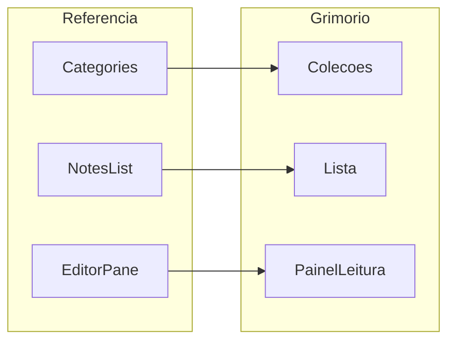

# Plano — Reformulação UI do Grimório (workspace Hades)

## Contexto

O **Grimório Pessoal** hoje é um fluxo em páginas separadas:

| Superfície | Arquivo | Papel |
| --- | --- | --- |
| Lista | `pages/grimorio.html` + `js/grimorio.js` | Suas + Reveladas, busca, Nova inscrição |
| Visão | `pages/grimorio-nota.html` + `js/grimorio-nota.js` | Leitura, revelar, clonar/recusar, ecos, ícones trilha/copiar |
| Edição | `pages/grimorio-editar.html` + `js/grimorio-editar.js` | Form + chips de marcas; Guardar → visão |

A referência visual (notes app em 3 colunas: Categories · Notes list · Editor) pede um **workspace contínuo** master-detail, não uma lista solta + navegação full-page para ler.

Funcionalidade recente (não reabrir):

- Visão ≠ edição ([`docs/plano-grimorio-visao-clone-tags.md`](./plano-grimorio-visao-clone-tags.md))
- Chips de marcas, clone/recusa, eventos ao dono, atalho `?fromNote=`
- Design System Hades obrigatório ([`css/hades-tokens.css`](../css/hades-tokens.css), Task 11 do plano social)

A referência é **estrutura e hierarquia**, não paleta: proibido migrar para azul / light / Inter. Tom Domínio: ouro, sangue, pergaminho, Cinzel + Crimson Text, `btn-gold`.

## Diagnóstico (gap UI)

| Tema | Hoje | Referência | Gap Hades |
| --- | --- | --- | --- |
| Layout | 1 coluna no main | 3 colunas | Workspace filtros \| lista \| leitura |
| Categorias | Duas seções empilhadas | Rail Categories | Coleções Domínio + counts |
| Lista | Cards título/meta/tags | Título + excerpt + seleção | Linha selecionável com preview do `body` |
| Leitura | Página própria | Painel direito | Painel no workspace + `?id=` |
| Edição | Página própria | Editor no painel | **Manter página dedicada** (foco no form) |
| Nav site | `app-shell` | Sidebar do app de notas | Shell permanece; workspace só no main |
| Ícones | Placeholders trilha/copiar | Toolbar densa | Slots SVG; ícones oficiais quando enviados |

## Objetivo

Reformular a UI do Grimório para um **workspace Hades** no espírito da referência:

1. Desktop largo: **Filtros · Lista · Leitura** dentro de `.app-shell__main`.
2. Selecionar inscrição na lista atualiza o painel de leitura (URL `grimorio.html?id=`).
3. Preservar contratos de visão/edição, reveladas, clone/recusa, chips, ecos e `fromNote`.
4. Deep links antigos (`grimorio-nota.html?id=`) continuam válidos via redirect.
5. Mobile/tablet sem esmagar 3 colunas (chips / lista ↔ leitura).

## Escopo

### Dentro

- Grid workspace em `grimorio.html` + CSS responsivo em `grimorio.css`.
- Rail de **coleções**: Suas · Reveladas · Fixadas · Por trilha · Por marca (filtros, não CRUD de categorias).
- Lista com busca, contagem, Nova inscrição, excerpt, estado selecionado, dots de contexto (própria / revelada / fixada / trilha).
- Extrair painel de leitura de `grimorio-nota` para módulo reutilizável (ex. `js/grimorio-reading.js`).
- URL sync (`?id=`, opcional `?colecao=`).
- Redirect `grimorio-nota.html` → workspace; Guardar no editar → `grimorio.html?id=`.
- Empty states narrativos Domínio; toolbar de ícones sutis.
- Smoke estático + checklist visual Hades (anti light/azul).
- Este documento como fonte de verdade da implementação.

### Fora (salvo decisão)

- Rich-text / toolbar de formatação da referência.
- Cores de nota, lixeira, categorias livres criadas pelo usuário.
- Remover `app-shell` ou substituir nav do site pela sidebar azul da ref.
- “Espelhar na trilha” (fase seguinte do plano de visão/clone).
- Mudanças de schema/API além do já entregue (clone/events).
- Redesign global do Design System.

### Arquivos previstos

| Arquivo | Papel |
| --- | --- |
| `docs/plano-grimorio-ui-workspace.md` | Este plano |
| `pages/grimorio.html` | Markup do grid 3 panes |
| `css/grimorio.css` | Layout workspace, lista feed, painel leitura |
| `js/grimorio.js` | Estado coleção / seleção / URL / render lista |
| `js/grimorio-reading.js` (novo) | Painel leitura + ações por papel |
| `pages/grimorio-nota.html` / `js/grimorio-nota.js` | Redirect fino (ou thin wrapper) |
| `js/grimorio-editar.js` | Retorno pós-Guardar → workspace `?id=` |
| `js/api.js` | `ROUTES.grimorioNota(id)` → `grimorio.html?id=` |
| `tests/grimorio-ui-workspace-smoke.mjs` | Smoke |

---

## Task 0 — Decisões de produto *(fechada)*

| # | Tema | Decisão |
| --- | --- | --- |
| 1 | App-shell | **Mantém** nav do site; workspace só no main (sem clonar sidebar azul) |
| 2 | Colunas desktop | **Filtros \| Lista \| Leitura** (≥1200px) |
| 3 | Tablet / mobile | Lista \| Leitura; filtros em chips/sheet; mobile uma superfície por vez |
| 4 | Visão | Painel direito = leitura; deep link `grimorio.html?id=` |
| 5 | Edição | Página dedicada `grimorio-editar.html`; Guardar → workspace com `?id=` |
| 6 | Categories da ref. | Coleções: Suas · Reveladas · Fixadas · Por trilha · Por marca |
| 7 | Ícones | Toolbar sutil; SVGs oficiais quando o autor enviar (`data-icon`) |

### Ideias da referência acolhidas (traduzidas)

| Referência | No Domínio |
| --- | --- |
| Categories + counts | Coleções com contagem |
| Search + ADD NOTE | Busca + `btn-gold` Nova inscrição |
| Lista com preview | Excerpt do corpo + chips |
| Dot colorido | Dot de contexto (tokens Hades) |
| Tags sob título | Chips existentes |
| Toolbar ícones | Trilha / copiar / ações por papel |

---

## Mapa referência → Hades



| Referência | Grimório Hades |
| --- | --- |
| Sidebar azul | Rail escuro, borda `--hades-gold-dark`, texto Cinzel uppercase |
| + ADD NOTE | `btn-gold` → `grimorio-editar.html` |
| Search Notes | Input Crimson; placeholder Domínio |
| Editor pane | **Leitura** tipográfica (não form); Editar abre rota dedicada |
| Fundo branco | `--hades-bg` / `--hades-panel` / vignette do shell |

---

## Modelo de layout

### Desktop (≥1200px)

```
[ app-shell nav ] | [ filtros ~200px ] [ lista ~300–360px ] [ leitura flex 1 ]
```

### Tablet

- Filtros → chips horizontais ou sheet
- Lista \| Leitura lado a lado ou empilhados conforme largura

### Mobile

- Vista `lista` ou `leitura` (selecionar item → leitura; voltar → lista)
- App-shell drawer inalterado

### URL

| URL | Comportamento |
| --- | --- |
| `grimorio.html` | Workspace; coleção default = Suas |
| `grimorio.html?id=N` | Seleciona N e mostra leitura |
| `grimorio.html?colecao=reveladas` | Abre coleção Reveladas |
| `grimorio-nota.html?id=N` | Redirect → `grimorio.html?id=N` |
| `grimorio-editar.html` / `?id=` | Edição; após Guardar → `grimorio.html?id=` |

---

## Fase 0 — Auditoria rápida *(antes do CSS pesado)*

### Checklist técnico

- [x] Inventariar markup/CSS atuais de lista, cards, visão, seções dono/revelada.
- [x] Confirmar que `listNotes({ includeShared: true })` cobre counts das coleções sem API nova.
- [x] Definir excerpt (ex.: primeiros ~120 chars do `body`, sem quebrar mid-word).
- [x] Listar breakpoints alinhados ao shell (`980px` mobile drawer; workspace `1200px`).
- [x] Decidir se seleção usa `history.replaceState` ou full navigation leve.

### Achados da auditoria (2026-09-08)

- Lista: `grimorio.html` + `grimorio.js` (seções Suas / Reveladas, cards com link full-page).
- Visão: `grimorio-nota.html` + `grimorio-nota.js` (seções dono/revelada, ecos, revelar, ícones).
- `listNotes({ includeShared: true })` já devolve `notes` + `sharedWithMe` com `body`, `tags`, `lessonId`, `pinned` — counts locais ok.
- Excerpt: 120 chars do `body`, corte no último espaço quando possível.
- Breakpoints: workspace 3 colunas ≥1200px; tablet chips; mobile lista ↔ leitura.
- URL: `history.replaceState` para `?id=` / `?colecao=` (sem reload).

### Perguntas (respondidas na Task 0 acima)

Não bloqueiam mais a implementação; qualquer mudança de Q1–Q7 atualiza esta tabela e as fases.

---

## Fase 1 — Skeleton do workspace

**Status:** concluída

1. Reestruturar `grimorio.html`: regiões `grimorio-workspace__filters`, `__list`, `__reading`.
2. CSS grid/flex em `grimorio.css`; esconder reading vazio com empty state.
3. Responsivo: breakpoints documentados.

**Pronto quando:** três regiões visíveis no desktop vazio; mobile não mostra 3 colunas esmagadas.

---

## Fase 2 — Coleções + lista

**Status:** concluída

1. Rail: Suas / Reveladas / Fixadas + derivadas (aulas/marcas presentes nos dados).
2. Busca filtra a coleção ativa.
3. Item: título, meta, excerpt, chips, dot, estado `is-selected`.
4. CTA Nova inscrição.

**Pronto quando:** trocar coleção atualiza lista e counts; clique seleciona item.

---

## Fase 3 — Painel de leitura

**Status:** concluída

1. Extrair lógica de `grimorio-nota.js` → `grimorio-reading.js` (ou equivalente).
2. Montar painel no workspace ao selecionar / ao `?id=`.
3. Preservar seções: Sua inscrição · Revelada a você · Ecos · Revelar; quick icons trilha/copiar.
4. Defesa: Clonar/Recusar só se não for dono; `[hidden]` com `display: none !important` onde `btn-gold` conflitar.

**Pronto quando:** leitura no painel equivale à página de visão atual.

---

## Fase 4 — Rotas e retorno do editar

**Status:** concluída

1. `ROUTES.grimorioNota(id)` → `grimorio.html?id=`.
2. `grimorio-nota.html` redirect (JS ou meta) preservando `id`.
3. `grimorio-editar.js` pós-Guardar → workspace `?id=` (via `ROUTES.grimorioNota`).
4. Dashboard preview / souls links continuam abrindo a inscrição correta.

**Pronto quando:** deep links e Guardar aterrissam no workspace selecionado.

---

## Fase 5 — Polish Hades + ícones

**Status:** concluída

1. Empty states (“O Grimório espera…”, “Nada foi revelado…”).
2. Hierarquia tipográfica lista vs leitura; bordas/painéis gold-dark.
3. Canvas de leitura/edição alinhado à referência (toolbar · título · marcas · corpo), sem UI azul/light.
4. Trocar placeholders SVG quando o autor enviar arte.
5. Audit visual: zero look “SaaS azul”.

**Pronto quando:** checklist visual Hades passa em desktop e mobile.

---

## Fase 6 — Smoke

**Status:** concluída

| Cenário | Esperado |
| --- | --- |
| Desktop workspace | 3 regiões; seleção atualiza leitura |
| Coleção Reveladas | Só shared; Clonar/Recusar no painel |
| Dono | Sem Clonar/Recusar; Editar/Rasgar/Revelar |
| `grimorio-nota.html?id=` | Abre workspace com id |
| Guardar edição | Volta ao workspace com id |
| Mobile | Lista → leitura → voltar |
| Tokens | Só `--hades-*` / Cinzel / Crimson / `btn-gold` |

Arquivo: `tests/grimorio-ui-workspace-smoke.mjs` + inclusão em `npm run check`.

---

## Ordem de implementação

1. Fase 0 checklist (rápida)  
2. Fase 1 skeleton  
3. Fase 2 coleções/lista  
4. Fase 3 reading pane  
5. Fase 4 redirects  
6. Fase 5 polish  
7. Fase 6 smoke  

## Riscos

| Risco | Mitigação |
| --- | --- |
| Shell + rail = apertado | Rail ~200px; tablet vira chips |
| Duplicar `grimorio-nota.js` | Extrair módulo único de leitura |
| Expectativa de editor na 3ª coluna | CTA Editar explícito; form na rota dedicada |
| Regressão clone/recusa/`[hidden]` | Reusar lógica e regras CSS `!important` já aplicadas |

## Critérios de aceite (MVP)

- Desktop: filtros + lista + leitura no Hades, sem UI light/azul da referência.  
- Clique na lista atualiza o painel e a URL `?id=`.  
- Clone / Recusar / Revelar / Editar / Rasgar / chips / fromNote corretos por papel.  
- Deep link antigo ainda abre a inscrição.  
- Mobile utilizável sem 3 colunas simultâneas.  
- Fonte de verdade deste doc seguida na implementação (como o plano do Espelho).
