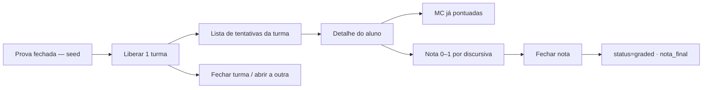

# Plano — Prova Online do Módulo 1 (Provação do Círculo Mágico)

**Status:** ✅ **feito** (fases A–E · 2026-09-24)  
**Valor da prova:** 20 pontos (12 MC automáticas + 8 discursivas manuais)  
**Duração:** 1 h 30 min (cronômetro **server-authoritative**)  
**Gate:** começa **fechada**; o Mestre libera **1 turma por vez** (`TCG01` ou `TCG02`)  
**Tentativas:** **1 por aluno** (unique `(exam_id, user_id)` — sem refazer)  
**Conteúdo:** [`docs/avaliacao-modulo1-provacao-circulo-magico.md`](./avaliacao-modulo1-provacao-circulo-magico.md)  
**Playbook (liberação):** [`playbook-liberar-prova-modulo1.md`](./playbook-liberar-prova-modulo1.md)  
**QA manual:** [`checklist-prova-qa-manual.md`](./checklist-prova-qa-manual.md)  
**Stack alvo:** páginas HTML + ES modules + `api/*.js` + Supabase (mesmo padrão de aulas / ClassInd-dle / Almas)

---

## 1. Objetivos de aceite

1. Aluno faz a prova em UI **estilo Google Forms**, **1 questão por tela**, com navegação Anterior / Próxima e indicador “Questão X de 20”.
2. Tempo limite **90 minutos**; aviso claro: **não sair da página** / não abrir outra aba.
3. Se o aluno sair e voltar ao site, é **redirecionado direto à prova**, na **mesma questão**, com o **cronômetro que não pausou**.
4. Saídas de foco (aba/janela) e abertura de nova aba/janela são **registradas** e **visíveis ao admin**.
5. MC (1–12) corrigidas **automaticamente**; discursivas (13–20) o admin **nota manualmente**; a **nota final só fecha** quando o admin confirmar.
6. Existe **seção da prova** no dashboard do admin (Ferramentas do Mestre + hub em Almas / página dedicada).
7. Prova nasce **bloqueada**; o Mestre **desbloqueia uma turma de cada vez** (a outra permanece fechada).
8. Cada aluno faz a prova **apenas uma vez** (iniciar/enviar consome a única tentativa; F5 retoma a mesma, não cria outra).

---

## 2. Diagnóstico do que já existe

| Peça | Onde | Reaproveitar? |
| --- | --- | --- |
| Conteúdo + gabarito | `docs/avaliacao-modulo1-provacao-circulo-magico.md` | Sim — virar JSON de questões (sem gabarito no client) |
| Auth / roles | `js/api.js`, `api/auth.js`, `users.role` | Sim — `student` faz; `admin` corrige |
| Admin hub | `pages/souls.html`, `#master-tools` em `dashboard.html` | Sim — nova aba / botão |
| Quiz ao vivo | ClassInd-dle | Inspiração de API por actions; **não** misturar salas |
| Parágrafos de aula | `lesson_paragraphs` | Modelo de texto longo; prova terá tabelas próprias |
| Timer de prova | — | **Não existe** — criar do zero |

Não há SPA React: seguir o padrão `pages/*.html` + `js/*.js` + `css/*.css` + `api/prova.js`.

---

## 3. Design da solução

### 3.1 Fluxo do aluno

```mermaid
sequenceDiagram
  participant A as Aluno
  participant UI as prova.html
  participant API as api/prova.js
  participant DB as Supabase

  A->>UI: Abrir Prova (dashboard / link)
  UI->>API: getAttempt / startAttempt
  alt Sem tentativa ativa e janela aberta
    API->>DB: cria attempt (started_at, ends_at)
    API-->>UI: attempt + questão atual (sem gabarito)
  else Tentativa em andamento
    API-->>UI: resume (current_index, remaining_ms)
  else Tempo esgotado / já enviada
    API-->>UI: locked / review-only
  end

  loop Cada resposta
    A->>UI: responde + Próxima
    UI->>API: saveAnswer (autosave)
    API->>DB: upsert answer
  end

  Note over UI: blur / visibilitychange / beforeunload
  UI->>API: reportIntegrityEvent
  API->>DB: integrity_events++

  A->>UI: Enviar prova
  UI->>API: submitAttempt
  API->>DB: auto-grade MC; status=submitted
  API-->>UI: “Aguardando correção do Mestre”
```

### 3.2 Fluxo do admin



### 3.3 UX — estilo Forms, 1 questão por vez

Tela do aluno (chrome leve, sem nav de aulas durante a tentativa):

| Elemento | Comportamento |
| --- | --- |
| **Header** | Título da prova · “Questão N de 20” · **cronômetro** (mm:ss) |
| **Aviso sticky** | “Não saia desta página. Se sair, o tempo continua.” |
| **Corpo** | Enunciado + alternativas (radio) **ou** textarea discursiva |
| **Rodapé** | Anterior · Próxima · (última) Enviar prova |
| **Progresso** | Barra ou dots 1–20 (clicáveis só em questões já visitadas / todas liberadas — decidir na Task F2: **recomendado: livre navegar entre questões já desbloqueadas; todas liberadas desde o início**) |

Tom visual: tokens Hades (`hades-tokens.css` + `app-shell`), mas layout **limpo tipo Forms** (card branco/pergaminho, tipografia legível, sem dashboard clutter).

### 3.4 Cronômetro server-authoritative

- No `startAttempt`: `started_at = now()`, `ends_at = started_at + 90 minutes`.
- Client mostra `remaining_ms = ends_at - server_now` (API devolve `serverNow` + `endsAt` a cada poll / save).
- **Nunca** confiar só no `setInterval` local para liberar envio: `submitAttempt` e `saveAnswer` rejeitam se `now > ends_at`.
- Ao expirar: auto-submit no client (best-effort) + no próximo request o servidor força `status = timed_out` e congela respostas.

### 3.5 Retorno à prova (não “pausar”)

- Qualquer rota autenticada (dashboard, aulas, etc.) consulta `getActiveProvaAttempt`.
- Se existir tentativa `in_progress` (e ainda dentro do prazo **ou** já estourou sem submit): **redirect forçado** para `prova.html` (exceto admin).
- Persistência: `current_question_index` + respostas no DB → UI reabre na questão salva.
- Timer: calcula pelo `ends_at` do servidor → **não zera** ao fechar a aba.

### 3.6 Integridade (sair da tela / nova janela)

Eventos client (best-effort; adversário avançado pode burlar — suficiente para turma adolescente):

| Evento | Detecção | Payload ao admin |
| --- | --- | --- |
| Mudou de aba / minimizou | `document.visibilitychange` → `hidden` | `tab_blur` |
| Perdeu foco da janela | `window.blur` (debounce c/ visibility) | `window_blur` |
| Tentou fechar / sair | `beforeunload` + `pagehide` | `page_leave` |
| Voltou | `visibilitychange` → `visible` | `tab_focus` (+ duração ausente se possível) |
| Nova aba do mesmo site | Ao boot de outra página com sessão: se attempt ativa → redirect + log `navigated_away` | |

Armazenar em `prova_integrity_events` (ou JSONB na attempt): `{ type, at, meta }`.  
Admin vê: **contagem**, **timeline**, badge “atenção” se `blur_count >= N` (ex.: 3).

**Aviso UI:** banner permanente + modal na 1ª saída detectada.

### 3.7 Correção e fechamento de nota

| Bloco | Quem | Regra |
| --- | --- | --- |
| Q1–12 | Servidor no `submit` | Gabarito só no server (`api/_lib/prova/answer-key.js`). 1 ponto cada. |
| Q13–20 | Admin | 0–1 ponto cada (fracionário permitido: 0, 0.25, 0.5, 0.75, 1) com rubrica curta opcional. |
| **Nota final** | Admin | `finalizeGrade`: `nota_final = soma_mc + soma_disc`; `status = graded`. Aluno só vê nota **depois** do finalize. |

Estados da tentativa:

```
not_started → in_progress → submitted | timed_out → graded
```

Antes de `graded`, aluno vê: “Prova enviada — aguardando correção do Mestre” (e opcionalmente acertos MC só se o admin liberar preview — **default: não mostrar nota parcial até fechar**).

### 3.8 Janela de disponibilidade (controle do Mestre)

**Política (v1) — travar no plano e na UI da Task D1:**

| Regra | Detalhe |
| --- | --- |
| **Começa bloqueada** | Seed: `is_open = false`, `open_turmas = {}`. Aluno vê “prova ainda não aberta”. |
| **1 turma por vez** | O Mestre libera **só** `TCG01` **ou** só `TCG02` (nunca as duas ao mesmo tempo na v1). A outra turma continua bloqueada. |
| **Fechar / trocar** | Pode fechar a turma atual (volta bloqueada) e, depois, abrir a outra. Quem já iniciou com a turma liberada **continua** a tentativa (`in_progress` / já enviada) — fechar o gate só impede **novos** `startAttempt`. |
| **1 tentativa por aluno** | Constraint unique `(exam_id, user_id)`. Segundo `startAttempt` → `409`. Retomar = mesma attempt (F5 / redirect C1), não nova prova. |

Admin pode:

- **Liberar / fechar** a prova **por turma** (`adminSetExamOpen` + `open_turmas` com exatamente 0 ou 1 código).
- Ver lista de tentativas, filtros, integrity flags.
- Corrigir discursivas e **Fechar nota**.
- (Opcional fase 2) Abrir as duas turmas juntas · reabrir tentativa · estender tempo pontual.

---

## 4. Modelo de dados (Supabase)

Migration sugerida: `db/migrate-YYYY-MM-DD-prova-modulo1.sql`

### `prova_exams`

| Coluna | Tipo | Notas |
| --- | --- | --- |
| `id` | text PK | ex.: `modulo1-provacao` |
| `title` | text | |
| `duration_minutes` | int | default 90 |
| `total_points` | numeric | 20 |
| `is_open` | boolean | gate master — **default false** (bloqueada) |
| `open_turmas` | text[] | na v1: **0 ou 1** turma (`TCG01` \| `TCG02`); vazio = ninguém inicia |
| `opens_at` / `closes_at` | timestamptz | opcional (janela extra) |

### `prova_attempts`

| Coluna | Tipo | Notas |
| --- | --- | --- |
| `id` | uuid PK | |
| `exam_id` | text FK | |
| `user_id` | integer FK → users | **unique `(exam_id, user_id)`** — 1 tentativa por aluno (sem refazer) |
| `status` | text | `in_progress` \| `submitted` \| `timed_out` \| `graded` |
| `started_at` | timestamptz | |
| `ends_at` | timestamptz | |
| `submitted_at` | timestamptz | |
| `current_question_index` | int | 0–19 |
| `mc_score` | numeric | preenchido no submit |
| `discursive_score` | numeric | soma manual |
| `final_score` | numeric | só após finalize |
| `graded_at` / `graded_by` | | |
| `admin_notes` | text | opcional |
| `integrity_summary` | jsonb | `{ blurCount, leaveCount, lastEventAt }` |

### `prova_answers`

| Coluna | Tipo | Notas |
| --- | --- | --- |
| `attempt_id` | uuid | |
| `question_id` | text | `q01`…`q20` |
| `choice` | text | `A`–`E` (MC) |
| `text_answer` | text | discursiva |
| `is_correct` | boolean | só MC, no submit |
| `points_awarded` | numeric | MC auto; discursiva admin |
| `updated_at` | timestamptz | |
| PK | `(attempt_id, question_id)` | |

### `prova_integrity_events`

| Coluna | Tipo |
| --- | --- |
| `id` | bigserial |
| `attempt_id` | uuid |
| `event_type` | text |
| `created_at` | timestamptz |
| `meta` | jsonb |

### Conteúdo das questões

- Arquivo server-only: `api/_lib/prova/questions-modulo1.js` (enunciados + alternativas **sem** gabarito no que vai ao client).
- Gabarito: `api/_lib/prova/answer-key-modulo1.js` (nunca enviado ao browser).
- Discursivas: enunciados + `rubricHints` só para admin no endpoint de correção.

---

## 5. API (`api/prova.js`)

Padrão: `POST { token, action, ... }` + helpers de sessão/`rejectUnlessAdmin`.

| Action | Quem | Função |
| --- | --- | --- |
| `getExamStatus` | aluno/admin | Aberta para a turma? Já tem attempt? Remaining? |
| `startAttempt` | aluno | Cria attempt **só se** gate aberto para a **turma do aluno** e **ainda não tem** attempt |
| `getAttempt` | aluno | Resume + questões sanitizadas + `current_index` + `ends_at` |
| `saveAnswer` | aluno | Upsert resposta + `current_question_index` |
| `setCurrentQuestion` | aluno | Só índice (navegação) |
| `reportIntegrityEvent` | aluno | Append event + bump summary |
| `submitAttempt` | aluno | Congela; auto-grade MC; `submitted` |
| `adminListAttempts` | admin | Lista + filtros turma/status/integrity |
| `adminGetAttempt` | admin | Respostas + eventos + rubricas |
| `adminScoreDiscursive` | admin | Nota por questão 13–20 |
| `adminFinalizeGrade` | admin | Soma + `graded`; trava edição |
| `adminSetExamOpen` | admin | Fecha tudo **ou** libera **exatamente 1 turma** (`is_open` + `open_turmas`) |
| `adminExtendTime` | admin | (fase 2) +N minutos num attempt |

Client: wrappers em `js/api.js` (`provaGetStatus`, `provaStart`, …).

---

## 6. Frontend — arquivos novos / tocados

| Arquivo | Papel |
| --- | --- |
| `pages/prova.html` | UI aluno (1 questão / timer / aviso) |
| `js/prova.js` | Orquestra fluxo, autosave, integrity, redirect resume |
| `js/prova/questions-ui.js` | Render MC vs discursiva |
| `js/prova/timer.js` | Display sync c/ server |
| `js/prova/integrity.js` | Listeners blur/visibility |
| `css/prova.css` | Layout Forms-like |
| `pages/prova-admin.html` **ou** aba em `souls.html` | Lista + correção |
| `js/prova-admin.js` | Correção manual + finalize |
| `css/prova-admin.css` | Tabela / detalhe |
| `pages/dashboard.html` + `js/dashboard.js` | Card “Prova Módulo 1” + redirect se attempt ativa |
| `js/app-shell.js` / páginas shell | Redirect global se `in_progress` (exceto `prova.html` e admin) |
| `js/api.js` | ROUTES + wrappers |
| `api/prova.js` + `_lib/prova/*` | Backend |
| `db/migrate-…-prova-modulo1.sql` | Schema |

**Seção no dashboard do admin**

1. Botão em `#master-tools`: **“Prova Módulo 1”** → `prova-admin.html` (ou souls tab).
2. Card resumo: aberta/fechada · N em andamento · N aguardando correção · N fechadas.
3. Em **Almas Registradas**: nova tab **“Prova”** (lista rápida + link para detalhe).

**Aluno no dashboard**

- Card “Provação do Círculo Mágico” (visível se a **turma do aluno** está liberada **ou** se já tem attempt).
- Estados: Bloqueada · Começar · Continuar · Enviada · Nota liberada (X/20).
- Copy quando bloqueada: “Ainda não liberada para a sua turma.”

---

## 7. Divisão em tasks

### Fase A — Fundação (dados + API mínima)

#### Task A1 — Migration e seed do exame
- [x] Criar `db/migrate-…-prova-modulo1.sql` com tabelas da §4.
- [x] Seed `prova_exams` (`modulo1-provacao`, 90 min, 20 pts, `is_open = false`).
- [x] Índices: `(exam_id, user_id)`, `(attempt_id)`, status, `ends_at`.
- [x] Rodar `npm run db:migrate` / validar no Supabase. → `db/migrate-2026-09-24-prova-modulo1.sql` (APPLY 2026-09-24)

#### Task A2 — Conteúdo server-side
- [x] Extrair questões 1–20 do MD para `api/_lib/prova/questions-modulo1.js`.
- [x] Extrair gabarito ME para `answer-key-modulo1.js`.
- [x] Função `sanitizeQuestionsForClient()` (remove `correct`, rubricas).
- [x] Função `gradeMultipleChoice(answers)` → `mc_score` + `is_correct` por questão.
  - Também: `questionsForAdmin()`, rubricas discursivas, `normalizeDiscursivePoints`, barrel `api/_lib/prova/index.js`.

#### Task A3 — API núcleo aluno
- [x] Criar `api/prova.js` com `getExamStatus`, `startAttempt`, `getAttempt`, `saveAnswer`, `setCurrentQuestion`, `submitAttempt`.
- [x] Validar sessão; bloquear admin de “fazer prova” como aluno (ou permitir teste com flag). → `asStudent: true`
- [x] Enforce `ends_at` em save/submit.
- [x] Unique 1 attempt por user/exam na v1.
- [x] Registrar action no `vercel.json` / rewrite se necessário (padrão dos outros `api/`). → rota em `local-server.mjs`; Vercel auto-rota `api/prova.js`
  - Wrappers client: `js/api.js` (`provaGetExamStatus` … `provaSubmitAttempt`)
  - Smoke: `tests/prova-api-smoke.mjs`

**Aceite A:** via curl/Postman, aluno inicia, salva Q1, submete; MC score calculado; gabarito não vaza no JSON do client.

---

### Fase B — UI do aluno (Forms + 1 questão + timer)

#### Task B1 — Página e layout Forms-like
- [x] `pages/prova.html` + `css/prova.css` (card central, tipografia legível, progresso).
- [x] Header: título, “Questão N de 20”, timer, aviso sticky de não sair.
- [x] Rodapé: Anterior / Próxima / Enviar (com confirm).
- [x] Sem link fácil para dashboard no chrome da tentativa (ou com confirm + log).
  - Página focada **sem** sidebar do app-shell; saída só via dialog de confirmação.
  - `js/prova.js` boot + prévia de layout; API de start/autosave na B2.
  - Smoke: `tests/prova-pages-smoke.mjs`

#### Task B2 — Render e navegação
- [x] `js/prova.js` + `questions-ui.js`: radio A–E (MC) e textarea (discursiva).
- [x] Autosave debounce (~800 ms) + save ao mudar de questão.
- [x] Restaurar `current_question_index` e respostas ao carregar.
- [x] Tela intro (regras + “Iniciar”) **antes** do `startAttempt` (cronômetro só após Iniciar).
  - Smoke: `tests/prova-b2-smoke.mjs`

#### Task B3 — Timer 90 min
- [x] `timer.js`: sync com `endsAt` + `serverNow`; tick local; re-sync a cada save/poll 30s.
- [x] UI vermelha nos últimos 5 min; modal ao zerar.
- [x] Auto-`submitAttempt` ao expirar; se falhar rede, retry e lock local.
  - Smoke: `tests/prova-b3-smoke.mjs`

**Aceite B:** aluno completa fluxo visual 1-a-1; F5 retoma mesma questão; timer coerente com servidor.

---

### Fase C — Persistência de sessão e anti-saída

#### Task C1 — Redirect global “voltar = prova”
- [x] `loadProvaGateForUser` barato em `session-bootstrap` → `gates.prova`.
- [x] `requireSession`: se `in_progress` → `location.replace(prova.html)` (cobre dashboard + páginas shell).
- [x] Exceção: `prova.html`, `auth.html`, rotas admin (`prova-admin.html` / role admin).
- [x] Documentar: fechar navegador **não pausa** o tempo (`prova.html` regras + dialog sair).

#### Task C2 — Integridade
- [x] `js/prova/integrity.js` + action `reportIntegrityEvent` (`api/_lib/prova/integrity-events.js`).
- [x] Debounce para não floodar (máx. 1 blur / 3s; leave pagehide+beforeunload juntos).
- [x] Modal na 1ª detecção de saída (`prova-dialog-integrity` + banner `is-alert`).
- [x] Atualizar `integrity_summary` na attempt (`blurCount` / `leaveCount` / `lastEventAt`).
  - Também: `navigated_away` no redirect C1; smoke `tests/prova-c2-smoke.mjs`.

#### Task C3 — Avisos e copy
- [x] Textos em português simples (`js/prova/copy.js` + HTML/JS).
- [x] beforeunload: aviso nativo ao tentar fechar com prova em andamento (`integrity.js` + `allowUnload` na saída confirmada).

**Aceite C:** sair para dashboard redireciona de volta; integrity events gravados; timer não reseta. (Admin vê eventos na Fase D.)

---

### Fase D — Admin: lista, correção, fechar nota, dashboard

#### Task D1 — Gate e Ferramentas do Mestre
- [x] Botão **Prova Módulo 1** em `#master-tools` (`dashboard.html` / `dashboard.js`).
- [x] `adminSetExamOpen`: estados da UI = **Fechada** · **Só TCG01** · **Só TCG02** (nunca as duas juntas na v1).
- [x] Persistência: `is_open=false` + `open_turmas=[]` **ou** `is_open=true` + `open_turmas=[umaTurma]`.
- [x] Se `is_open=true` com `open_turmas` vazio → API trata como **fechada** (`examGateFromRow` / `isExamOpenForUser`).
- [x] Copy admin: “A prova começa bloqueada. Liberar uma turma por vez. Cada aluno só faz 1 vez.”
- [x] Gate no dashboard admin (Ferramentas do Mestre → modal Fechada / Só TCG01 / Só TCG02; contadores via `adminGetProvaOverview`). Entrada do aluno: **Aulas → Módulo 1**.
- [x] Já coberto no backend aluno (A3): unique 1 attempt; gate respeita turma.
  - Smoke: `tests/prova-d1-smoke.mjs`

#### Task D2 — Hub de correção
- [x] Página `prova-admin.html` (lista admin; nav `data-admin-only`).
- [x] Lista: aluno, turma, status, tempo restante / enviado, blurCount, MC parcial (só admin), nota final.
- [x] Filtros: turma, status (`in_progress`, `awaiting`/`submitted`/`timed_out`/`graded`), “com alertas”.
  - API: `adminListAttempts`; smoke `tests/prova-d2-smoke.mjs`

#### Task D3 — Correção manual + finalize
- [x] Detalhe do attempt: enunciado + resposta do aluno + campo nota 0–1 + comentário opcional (Q13–20).
- [x] Mostrar gabarito MC e acertos (só admin).
- [x] Timeline de integrity events.
- [x] Botão **Fechar nota** → `adminFinalizeGrade` (confirmação); depois disso aluno vê `final_score`.
- [x] Impedir alterar notas após `graded` (**exceto** via contestação: `adminRespondContest` → reopen).
  - API: `adminGetAttempt`, `adminScoreDiscursive`, `adminFinalizeGrade`; smoke `tests/prova-d3-smoke.mjs`

#### Task D4 — Visão do aluno pós-envio
- [x] Tela “Aguardando correção” (`prova-done` + botão Atualizar status).
- [x] Após `graded`: nota X/20 + breakdown MC vs discursivas + **gabarito/comentários por questão** (`review`).
  - DTO: `awaitingGrade` / scores só em `graded`; `buildStudentReview` no `getAttempt`; smokes `tests/prova-d4-smoke.mjs` + `tests/prova-review-smoke.mjs`
- [x] **Contestação de nota:** aluno explica o que acha errado (`contestGrade`); Mestre responde ou reabre correção (`adminRespondContest`); re-fechamento marca `revised`.
  - Migration `db/migrate-2026-09-24-prova-contestacao.sql`; smoke `tests/prova-contest-smoke.mjs`
- [x] **Reset de tentativa:** Mestre apaga a prova do aluno (`adminResetAttempt`) para ele poder fazer de novo.

**Aceite D:** admin libera **uma** turma → só essa turma inicia → cada aluno **1** attempt → admin nota discursivas → fecha nota → aluno vê X/20; fechar o gate não apaga tentativas já feitas. ✅ (D1–D4 + contestação)

---

### Fase E — Polimento, segurança e QA

#### Task E1 — Segurança
- [x] Gabarito nunca no HTML/JS público **como catálogo embutido** (só via API `review` **após** `graded`).
- [x] Rate limit em `reportIntegrityEvent` e `saveAnswer`.
- [x] RLS ou só service role (padrão do projeto: API com service key).
- [x] Audit log admin (`admin_audit`) em finalize / open exam.

#### Task E2 — Acessibilidade e mobile
- [x] Radios/textarea usáveis no celular; timer legível; sem zoom quebrado.
- [x] Confirms claros em Enviar / Fechar nota.

#### Task E3 — Smokes / checklist manual
- [x] Script smoke opcional (`scripts/smoke-prova.mjs`) start → save → submit → grade.
- [x] Checklist humano: 2 turmas, blur, F5, expiração forçada (duration de teste 2 min em staging).
  - Checklist: [`checklist-prova-qa-manual.md`](./checklist-prova-qa-manual.md)
  - Vivo: `npm run smoke:prova` (SKIP se sem credenciais)

#### Task E4 — Docs e liberação
- [x] Atualizar este plano com “feito”.
- [x] Playbook curto: prova nasce fechada → liberar **TCG01** (ou TCG02) → alunos fazem (1×) → fechar turma / abrir a outra → corrigir → fechar notas.
  - [`playbook-liberar-prova-modulo1.md`](./playbook-liberar-prova-modulo1.md)
- [x] Link no conteúdo do módulo / dashboard.
  - Conteúdo: seção **Provação** em [`conteudo-modulo1-fundacoes-cultura-interface.md`](./conteudo-modulo1-fundacoes-cultura-interface.md)
  - **Aulas → Módulo 1** (entrada `prova-modulo1`); gate/correção nas Ferramentas do Mestre / hub admin
  - Sem card de preview no trilho do Painel (só na trilha de aulas)
**Aceite E:** segurança (E1) + mobile/confirms (E2) + smoke/checklist (E3) + docs/playbook/links (E4). ✅

---

## 8. Ordem sugerida de implementação

```text
A1 → A2 → A3 → B1 → B2 → B3 → C1 → C2 → C3 → D1 → D2 → D3 → D4 → E1 → E2 → E3 → E4  ✅
```

Paralelo possível (histórico): **D1** (gate UI) após A3; **C2** em paralelo com B3.

---

## 9. Fora de escopo (v1)

- Mais de uma tentativa por aluno (**já decidido: 1 só**).
- Liberar **as duas turmas ao mesmo tempo** (fase 2, se precisar).
- Proctoring com câmera / lockdown browser.
- Correção automática de discursivas (IA).
- Integração automática de nota com boletim externo.
- Prova offline.

---

## 10. Riscos e mitigações

| Risco | Mitigação |
| --- | --- |
| Aluno manipula relógio local | `ends_at` só no servidor |
| Aluno desliga evento de blur | Aceito na v1; contagem é sinal, não prova jurídica |
| Perda de resposta na última questão | Autosave + save no Enviar; submit inclui payload final |
| Redirect agressivo atrapalha admin/teste | Excluir `role=admin`; flag `?preview=1` só admin |
| Conteúdo longo nas discursivas | Textarea grande; contador de palavras opcional |

---

## 11. Critérios de pronto (DoD)

- [x] Prova aberta pelo admin; aluno inicia e vê 1 questão por vez estilo Forms.
- [x] 90 min server-side; aviso de não sair; F5 / sair e voltar → mesma questão, timer contínuo.
- [x] Eventos de saída visíveis no admin.
- [x] MC auto; discursivas manuais; nota final só após **Fechar nota**.
- [x] Seção da prova no dashboard admin (master-tools + lista/correção).
- [x] Linguagem da UI simples (alinhada ao MD da avaliação).
- [x] Playbook de liberação + checklist QA + smoke opcional.

---

## 12. Referências

- Conteúdo / gabarito: [`avaliacao-modulo1-provacao-circulo-magico.md`](./avaliacao-modulo1-provacao-circulo-magico.md)
- Conteúdo do módulo: [`conteudo-modulo1-fundacoes-cultura-interface.md`](./conteudo-modulo1-fundacoes-cultura-interface.md)
- Playbook (dia da prova): [`playbook-liberar-prova-modulo1.md`](./playbook-liberar-prova-modulo1.md)
- Checklist QA: [`checklist-prova-qa-manual.md`](./checklist-prova-qa-manual.md)
- Smoke vivo: `npm run smoke:prova` → `scripts/smoke-prova.mjs`
- Páginas: `pages/prova.html` (aluno) · `pages/prova-admin.html` (hub) · entrada em **Aulas → M1** · gate em `#master-tools`
- Padrão de plano + quiz vivo: [`plano-classind-dle-desempenho-ranking.md`](./plano-classind-dle-desempenho-ranking.md)
- Admin / Almas: [`plano-relatorio-admin-atividades-filtros.md`](./plano-relatorio-admin-atividades-filtros.md)
